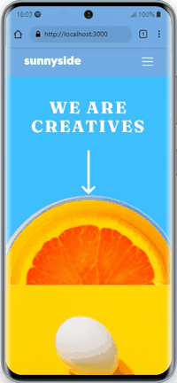
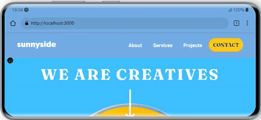
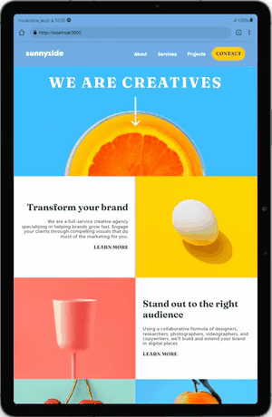
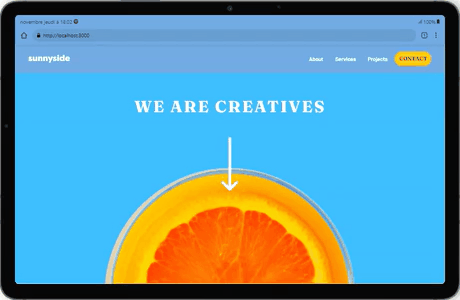

# Sunnyside #  

## Description ##  
This project is a landing page for a fictional design agency.  
It was inspired by a mockup found on **Frontend  Mentor** .  
The colors, fonts, images and general layout used were provided in said mockup and a few changes were made.

## Demo ##  
A deployment with **Github Pages** is available [here](https://laetitiabodin.github.io/sunnyside).

  
Smartphone - portrait
 
  
  

  
Smartphone - landscape
 
    
  

  
Tablet - portrait
 
    
  

  
Tablet - landscape
 
    
  

  
Laptop
 
    
  

## Development ##  

### React ###  
This app was created with [Create React App](https://create-react-app.dev/).  
A default `README` file was created with a few basic commands.  
It can be found [here](ReadMe/README.md).
  
### Typescript ###
This app uses **Typescript**.  
The config file can be found [here](tsconfig.json).
 
### TailwindCSS ###  
This app uses **TailwindCSS**.  
The config file can be found [here](tailwind.config.js).  
Find out more about TailwindCSS [here](https://tailwindcss.com/). 

### Environment ###  
A `.env` is created to contain the variable name for the build.  
No sensitive information is to be stored in that file.  
It is mainly used to create the absolute url for the `meta` tags (SEO).

### SEO ###  
`meta` tags with **Open Graph** and **Twitter cards** information are used.  
Find out more about Open Graph [here](https://ogp.me/).  
Find out more about Twitter cards [here](https://developer.twitter.com/en/docs/twitter-for-websites/cards/overview/markup).

### Icons ###  
**Canva** was used to create a `favicon` and a `card image` from the logo provided in the project starter pack.  
Find out more about Canva [here](https://www.canva.com/).  
Icons (SVGs) are directly embeddeb in the HTML.

## Credits ##  
The code was written by **Laëtitia Bodin** and was inspired by a free-to-use challenge from **Frontend Mentor**.  
More info regarding said challenge can be found [here](https://www.frontendmentor.io/challenges/sunnyside-agency-landing-page-7yVs3B6ef).

## Troubleshooting ##  
Should you experience some bug or want to offer some feedback regarding this project, feel free to open an issue for this repo and label it accordingly.  
Should you experience warnings regarding missing dependencies or updates needed, you might need to run `npm install` or `npm update`.